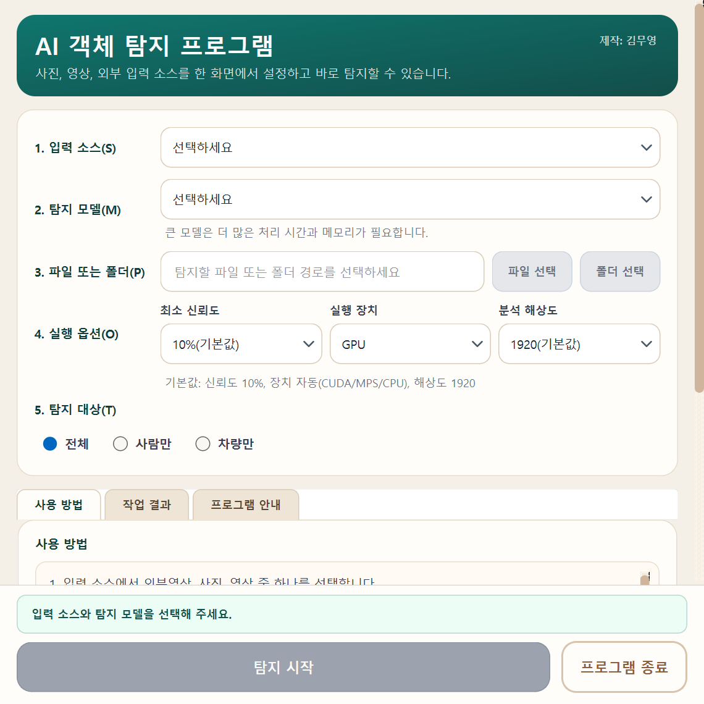

# Stay Up AI 객체 탐지 프로그램 사용설명서

처음 사용하는 분을 위한 Windows 실행 파일 안내

**대상 버전 V26.0908 | 문서 개정 2026년 9월 8일**

사진이나 영상에서 사람과 차량을 찾아 표시하고, 결과를 확인하는 프로그램입니다. 이 설명서는 프로그램 실행 파일을 전달받은 분이 **사진 한 장을 분석하고 결과를 직접 확인하는 것**부터 시작하도록 구성했습니다.

> 먼저 준비하세요: 전달받은 프로그램 전체 폴더, 제공자가 알려 준 인증 키, 사람이나 차량이 보이는 JPG 사진 한 장.

## 처음에는 이 순서로 사용하세요

1. 압축 파일을 받았다면 **모두 압축 풀기**를 한 뒤 프로그램의 **.exe 파일**을 실행합니다.
2. 전달받은 **인증 키**를 입력하고 확인을 누릅니다.
3. **입력 소스 → 사진**, **탐지 모델 → 사용할 모델**을 선택합니다.
4. **파일 선택**으로 사진 한 장을 고르고, 기본 설정을 확인한 뒤 **탐지 시작**을 누릅니다.
5. 완료 안내를 닫고 **작업 결과 → 원본과 비교**에서 표시된 대상을 확인합니다.

탐지된 대상이 없으면 결과 사진이 만들어지지 않을 수 있습니다. 이것만으로 실행 실패를 뜻하지는 않습니다.

## 필요한 페이지 찾아보기

| 보고 싶은 내용 | PDF 페이지 |
| --- | --- |
| 프로그램 준비와 인증 | 2 |
| 메인 화면 살펴보기 | 3 |
| 사진 한 장으로 처음 시작하기 | 4 |
| 모델과 실행 옵션 이해하기 | 5 |
| 여러 사진 분석과 저장 파일 | 6 |
| 영상 파일 분석하기 | 7 |
| 외부영상과 캡처보드 사용하기 | 8 |
| 결과 읽기와 작업 중단 | 9 |
| GPS 지도 만들기 | 10 |
| 자주 생기는 문제 해결하기 | 11 |

이 설명서는 V26.0908 기준입니다. 실행마다 새 폴더에 결과를 저장하며, 폴더 열기는 **작업 결과** 탭에서 사용합니다. 받은 프로그램의 버전은 인증 성공창 또는 창 제목에서 확인하세요.

<!-- pagebreak -->

## 1 프로그램 준비와 인증

### 받은 파일부터 확인하세요

프로그램 제공자가 전달한 **Windows 배포 파일**을 사용합니다. 압축 파일이라면 마우스 오른쪽 버튼을 눌러 **모두 압축 풀기**를 선택하고, 압축을 푼 폴더를 엽니다. 제공자가 안내한 프로그램 `.exe` 파일을 두 번 클릭합니다. 파일 이름은 배포본마다 다를 수 있습니다.

폴더 형태의 배포본은 `.exe`와 함께 있는 `_internal` 등 구성 폴더가 필요합니다. **실행 파일만 따로 꺼내지 말고 전체 폴더를 함께 보관하세요.** 바탕화면에서 실행하려면 실행 파일의 바로가기를 만들어 사용합니다. 프로그램과 결과를 저장할 여유 공간도 확보합니다.

> 이 안내는 완성된 EXE 배포본 기준입니다. 일반 사용자는 auto-py-to-exe를 실행하거나 Python을 따로 설치하는 절차 없이, 전달받은 실행 파일부터 사용합니다.

### 실행하고 인증하세요

1. 프로그램을 실행하면 버전 확인 후 **인증 키 입력창**이 나타납니다.
2. 프로그램 제공자가 알려 준 키를 입력합니다. 대소문자와 앞뒤 공백을 확인하세요.
3. **확인**을 누릅니다. 인증 성공창에서 **앱 버전과 자동 감지 장치**를 확인합니다.
4. 성공창의 확인 버튼을 누르면 메인 화면으로 이동합니다.

| 화면에 나타나는 상태 | 다음 행동 |
| --- | --- |
| 인증 키를 모름 | 프로그램을 전달한 담당자에게 문의합니다. |
| 인증 실패 | 입력을 확인하고 다시 시도합니다. 잘못된 키를 3회 입력하면 앱이 종료됩니다. |
| 빈 입력 안내 | 키를 입력하고 다시 확인합니다. 빈 입력은 실패 횟수에 포함되지 않습니다. |
| 인증 취소 | 앱이 종료됩니다. 사용하려면 프로그램을 다시 실행합니다. |

### 인터넷과 실행 장치

**CPU**가 표시되어도 사용할 수 있습니다. 사용 가능한 NVIDIA 가속 환경이 있으면 **GPU**, Apple 환경에서는 **MPS**가 선택될 수 있습니다. Windows 사용자는 보통 GPU 또는 CPU를 보게 됩니다.

버전·온라인 소식 조회에 실패해도 탐지를 사용할 수 있도록 되어 있습니다. 다만 **선택한 모델 파일이 없으면 최초 다운로드를 위해 인터넷 연결이 필요할 수 있습니다.** 오프라인에서 사용할 계획이라면 연결 가능한 곳에서 사용할 모델과 시험 사진으로 먼저 실행해 보세요. 지도 배경을 표시할 때도 인터넷 연결이 필요합니다.

<!-- pagebreak -->

## 2 메인 화면 살펴보기

화면에 적힌 **1번부터 5번까지** 설정한 뒤 맨 아래 **탐지 시작**을 누릅니다.

*V26.0908 소스로 실행한 Windows 설정 화면입니다. 탐지 전의 상태이며, 실행 장치는 PC에 따라 GPU 또는 CPU 등으로 표시됩니다.*

| 화면 위치 | 하는 일 |
| --- | --- |
| 1 입력 소스 | 사진, 영상, 외부영상 중 분석할 종류를 고릅니다. |
| 2 탐지 모델 | 분석에 사용할 AI 모델을 고릅니다. |
| 3 파일 또는 폴더 | 파일·폴더를 선택합니다. 외부영상에서는 장치 번호를 입력합니다. |
| 4 실행 옵션 / 5 탐지 대상 | 신뢰도·실행 장치·해상도와 사람·차량 선택을 확인합니다. |
| 아래 탭 / 하단 버튼 | 사용 방법·작업 결과를 보고 탐지를 시작하거나 종료합니다. |

작은 화면에서는 오른쪽 스크롤로 아래 내용을 봅니다. 실행 버튼과 상태 안내는 하단에 표시됩니다. **저장 폴더 열기**는 **작업 결과** 탭에 있습니다. 온라인 공지가 있으면 **온라인 소식** 탭도 나타납니다.

<!-- pagebreak -->

## 3 사진 한 장으로 처음 시작하기

사람이나 차량이 비교적 잘 보이는 **JPG 사진 한 장**을 준비하세요. 아래 절차를 마치면 저장된 결과와 원본을 비교할 수 있습니다.

### 1 사진을 선택합니다

**1. 입력 소스** 목록을 클릭해 **사진**을 선택합니다. 그다음 **2. 탐지 모델** 목록에서 사용할 모델을 고릅니다. `선택하세요` 상태로 두면 탐지를 시작할 수 없습니다.

화면에는 **YoloV26_최대(추천)**이 표시됩니다. 큰 모델은 준비·분석 시간이 길 수 있습니다. 먼저 가볍게 동작을 확인하려면 목록의 **YoloV11_최소** 같은 작은 모델을 선택할 수 있습니다. 해당 모델이 배포본에 없으면 다운로드가 필요할 수 있습니다.

### 2 파일을 고릅니다

**파일 선택**을 누르고 준비한 사진을 고른 뒤 **열기**를 누릅니다. 경로 입력칸에 선택한 파일이 표시되는지 확인합니다. 파일 선택 버튼이 회색이면 먼저 입력 소스를 사진으로 바꿨는지 확인하세요.

### 3 설정을 확인합니다

| 항목 | 처음 사용할 때 확인할 값 |
| --- | --- |
| 최소 신뢰도 | **10%(기본값)** |
| 실행 장치 | 프로그램이 자동 감지한 값 그대로 사용 |
| 분석 해상도 | **1920(기본값)** |
| 탐지 대상 | **전체** - 사람과 차량을 함께 탐지 |

처리가 너무 느리면 작은 모델과 **640** 해상도로 시험해 볼 수 있습니다. 이 경우 작은 대상의 탐지 결과가 달라질 수 있습니다. 옵션을 바꾸려면 선택 목록을 클릭해 펼칩니다.

### 4 탐지를 시작하고 기다립니다

하단의 **탐지 시작**을 누릅니다. 진행 창에 모델 준비·분석·저장 등의 단계와 경과시간이 표시됩니다. 모델을 처음 준비하는 데 시간이 걸릴 수 있습니다. 작업이 끝날 때까지 기다립니다.

### 5 결과와 원본을 확인합니다

완료 안내를 읽고 닫습니다. 사진의 위치를 지도에서 볼지 묻는 **GPS 정보 분석** 창이 나오면, 첫 연습에서는 **아니요**를 눌러 넘어가도 됩니다. 저장된 탐지 결과는 그대로 남습니다.

**작업 결과** 탭에서 파일을 고르고 **원본과 비교**를 누릅니다. 왼쪽 원본과 오른쪽 탐지 결과를 비교해 표시된 대상이 실제 사람·차량인지 확인합니다. **결과 열기**는 선택한 파일을, **저장 폴더 열기**는 파일이 저장된 폴더를 엽니다.

> 결과 목록이 비어 있으면 요약의 ‘객체 탐지’와 ‘처리 실패’를 확인하세요. 분석에 성공해도 사람이나 차량을 찾지 못한 사진은 저장하지 않습니다.

<!-- pagebreak -->

## 4 모델과 실행 옵션 이해하기

처음에는 기본값으로 사용하고, 속도나 결과를 확인하면서 **한 번에 한 항목씩** 바꿔 보세요. 같은 사진으로 전후 결과를 비교하면 차이를 이해하기 쉽습니다.

### 모델은 분석에 사용하는 AI입니다

선택 목록에는 **YoloV26**, **YoloV11**, **YoloV12** 계열이 있습니다. V26·V11은 최대·대·중·소·최소, V12는 최대·최소를 선택할 수 있습니다. 일반적으로 큰 모델은 더 많은 처리 시간과 메모리가 필요합니다. 더 큰 모델이 모든 사진에서 더 좋은 결과를 보장하지는 않습니다.

**화염전용탐지(예정)**은 아직 사용할 수 없어 선택이 비활성화되어 있습니다.

### 옵션별 의미

| 항목 | 의미와 사용 방법 |
| --- | --- |
| 최소 신뢰도 | AI가 찾은 후보를 결과에 표시할 기준입니다. 기본값은 10%입니다. 낮추면 후보가 늘고 잘못 표시하는 경우도 늘 수 있습니다. 높이면 애매한 후보가 줄지만 실제 대상을 놓칠 수 있습니다. |
| 실행 장치 | 분석을 수행하는 장치입니다. 처음에는 자동 감지된 값을 유지합니다. GPU나 MPS를 사용할 수 없으면 안내 후 CPU로 전환됩니다. |
| 분석 해상도 | 분석할 때 사용하는 이미지 크기 설정입니다. 기본값은 1920입니다. 높은 값은 처리 시간과 메모리를 더 사용할 수 있습니다. 4000(*)은 특히 부담이 큰 옵션입니다. |
| 탐지 대상 | **전체**는 사람과 차량, **사람만**은 사람, **차량만**은 차량을 찾습니다. 차량은 자동차·버스·트럭에 해당합니다. |

신뢰도 숫자는 **프로그램 전체의 정확도나 실제 대상일 확률을 보장하는 수치가 아닙니다.** 표시된 영역은 원본과 비교해 확인하세요. ‘전체’도 모든 종류의 물체를 탐지한다는 뜻은 아닙니다.

### 이런 때 바꿔 보세요

| 겪는 상황 | 시도할 변경 |
| --- | --- |
| 너무 느리거나 메모리가 부족함 | 실행 중인 작업을 취소하고 종료를 기다립니다. 작은 모델, 낮은 해상도로 다시 시험합니다. |
| 배경이나 다른 물체가 자꾸 표시됨 | 최소 신뢰도를 조금 높여 같은 사진으로 비교합니다. |
| 찾고 싶은 대상이 잘 표시되지 않음 | 탐지 대상 선택을 확인하고, 최소 신뢰도를 낮추거나 해상도를 높여 비교합니다. 흐리거나 너무 작은 대상은 놓칠 수 있습니다. |
| GPU를 골랐는데 CPU로 바뀜 | 현재 환경에서 GPU를 사용할 수 없는 상태입니다. 우선 CPU로 사용하고 필요하면 제공자에게 실행 환경을 문의합니다. |

<!-- pagebreak -->

## 5 여러 사진 분석과 저장 파일

### 파일 여러 개 또는 폴더를 선택합니다

1. **입력 소스 → 사진**을 선택하고 모델을 고릅니다.
2. **파일 선택** 창에서 Ctrl 키를 누른 채 여러 사진을 선택합니다. 연속된 파일은 Shift 키로 선택할 수 있습니다.
3. 한 폴더의 사진을 분석하려면 대신 **폴더 선택**을 누릅니다.
4. 옵션과 탐지 대상을 확인하고 **탐지 시작**을 누릅니다.
5. 완료 후 **작업 결과**에서 처리 성공·실패와 저장 파일 목록을 확인합니다.

폴더는 **한 번에 하나씩** 선택해 분석합니다. **그 폴더 바로 안에 있는 지원 사진만** 처리하며, 하위 폴더까지 자동으로 찾아 들어가지는 않습니다. 하위 폴더의 사진도 분석하려면 해당 폴더를 따로 선택하세요.

지원 사진 형식은 **JPG, JPEG, PNG, BMP, TIF, TIFF**입니다. 휴대전화의 HEIC 등 목록에 없는 형식은 지원 형식으로 준비하세요. GPS 지도도 필요하다면 형식을 바꾸는 과정에서 위치정보가 유지되는지 확인해야 합니다.

### 어떤 사진이 저장되나요

**선택한 탐지 대상이 발견된 사진만** 원본 복사본과 표시된 탐지본으로 저장합니다. 읽기·분석에 성공했지만 대상이 없었던 사진은 결과 파일을 만들지 않습니다. 사용자가 처음 고른 원본 사진은 수정하지 않습니다.

| 파일 예시 | 내용 |
| --- | --- |
| original_sample.jpg | 원본 복사본입니다. 원본에 있던 촬영·GPS 정보도 함께 보존합니다. |
| detected_sample.jpg | 탐지 영역과 분류 등이 표시된 결과 사진입니다. 탐지본은 JPG로 저장됩니다. |
| original_sample_1.jpg / detected_sample_1.jpg | 같은 실행 폴더 안에 같은 이름이 있으면 두 파일에 같은 번호를 붙입니다. |

예를 들어 `sample.png`를 분석하면 원본은 `original_sample.png`, 탐지본은 `detected_sample.jpg`가 됩니다. 위 이름과 숫자는 설명용 예시입니다.

### 저장 위치를 찾는 가장 쉬운 방법

**작업 결과 → 저장 폴더 열기**를 누르세요. **탐지 시작**을 누를 때마다 **detected_files** 아래에 시작 시각으로 구분한 새 폴더를 만듭니다. `20260908_143025`는 2026년 9월 8일 14시 30분 25초에 시작한 작업이며, 같은 이름이 있으면 `_1`, `_2`가 붙습니다.

한 번에 선택한 여러 사진은 한 실행 폴더에 모입니다. 사진 원본·탐지본과 후속 GPS 지도도 같은 폴더에 저장됩니다. 다시 탐지해도 이전 실행의 폴더와 파일은 그대로 남습니다.

EXE 포장 방식에 따라 이 폴더가 있는 위치가 달라질 수 있으므로 화면의 열기 버튼으로 실제 위치를 확인하세요. 결과를 보관하거나 전달할 때는 파일을 별도의 작업 폴더에도 복사해 두세요. 특히 단일 EXE 배포본에서는 종료 전에 필요한 결과를 별도 폴더로 복사하세요.

> 여러 사진의 탐지 수는 사진별 결과를 더한 값입니다. 같은 사람이 여러 사진에 나오면 반복 집계될 수 있습니다. 서로 다른 사람의 수를 세는 기능은 아닙니다.

<!-- pagebreak -->

## 6 영상 파일 분석하기

저장된 영상 파일 하나를 분석하고, 탐지 표시가 들어간 **MP4 결과 영상**을 만듭니다. 처음에는 짧은 영상으로 시험하세요.

### 사용 순서

1. **입력 소스 → 영상**을 선택합니다.
2. 사용할 **탐지 모델**을 고릅니다.
3. **파일 선택**을 누르고 영상 파일 **한 개**를 선택합니다. 영상에서는 폴더 선택을 사용하지 않습니다.
4. 실행 옵션과 탐지 대상을 확인하고 **탐지 시작**을 누릅니다.
5. 별도 미리보기 창과 진행 창에서 분석 상태를 확인합니다.
6. 분석 후 **결과 영상 전체 검증 중** 단계까지 기다립니다. 이 단계는 저장된 영상이 끝까지 읽히는지 확인하는 과정입니다.
7. 완료 안내를 확인하고 **작업 결과 → 결과 열기**에서 재생합니다. 파일이 필요하면 **저장 폴더 열기**를 누릅니다.

지원 영상 형식은 **MP4, MOV, AVI, MKV, WMV, WEBM**입니다. 파일 확장자가 지원되어도 영상 내부의 압축 형식이나 손상 상태에 따라 읽지 못할 수 있습니다.

### 결과 영상에서 알아둘 점

| 항목 | 설명 |
| --- | --- |
| 저장 파일 | 이번 실행 폴더에 저장합니다. 예를 들어 sample.mp4는 detected_sample.mp4가 됩니다. |
| 저장 시점 | 분석과 전체 검증을 거친 뒤 최종 결과 파일로 저장합니다. 분석이 끝난 것처럼 보여도 검증이 남아 있을 수 있습니다. |
| 소리 | 현재 결과 영상에는 원본 소리를 넣지 않습니다. 소리가 필요한 경우 원본 영상을 함께 보관하세요. |
| 탐지 수 | 전체 영상에서 한 화면에 가장 많이 잡힌 사람 수·차량 수를 각각 표시합니다. 영상을 지나간 총인원·총차량 수가 아닙니다. |
| 처리 속도 | 영상 길이, 모델, 해상도, PC에 따라 달라집니다. 실제 영상 재생시간보다 오래 걸릴 수 있습니다. |

### 중간에 멈추거나 부분 완료된 경우

중단하려면 진행 창의 **취소** 또는 Esc를 누르고 정리가 끝날 때까지 기다립니다. 취소한 영상은 완료된 MP4가 남는다고 기대하면 안 됩니다. 마지막 안내의 **정상 보존된 결과 파일**과 작업 결과 목록을 확인하세요.

**부분 완료**가 표시되면 주의 사항과 오류를 읽고 실제 저장된 영상을 재생해 확인합니다. 입력 끝을 확실히 판정하기 어려운 경우에도 검증된 결과를 보존할 수 있습니다. 상태만 보고 전체 구간이 모두 처리되었다고 판단하지 마세요.

<!-- pagebreak -->

## 7 외부영상과 캡처보드 사용하기

캡처보드는 외부 영상 신호를 PC로 받아오는 장치입니다. 이 모드에서는 들어오는 화면을 실시간으로 분석하고 별도 창에 보여 줍니다.

> **외부영상 모드는 영상을 파일로 저장하지 않습니다.** 미리보기와 최대 동시 탐지 수를 확인하는 용도입니다. 녹화 파일이 필요하다면 별도로 녹화한 뒤 ‘영상’ 모드에서 분석하세요.

### 사용 순서

1. 캡처보드를 PC와 영상 장비에 연결하고 입력 신호가 들어오는지 확인합니다.
2. **입력 소스 → 외부영상(캡처보드)**를 선택합니다.
3. 사용할 모델을 고릅니다.
4. **3. 장치 번호** 입력칸에 연결된 장치 번호를 입력합니다. **0**부터 사용할 수 있으며 비워 두면 0번을 사용합니다.
5. 실행 옵션과 탐지 대상을 확인하고 **탐지 시작**을 누릅니다.
6. 별도로 열린 **실시간 탐지 미리보기** 창에서 화면을 확인합니다.
7. 끝내려면 진행 창의 **취소** 또는 Esc를 누르고 작업 정리가 끝날 때까지 기다립니다.

장치 번호는 PC마다 다릅니다. 웹캠과 캡처보드가 함께 연결되어 있으면 0번이 웹캠일 수 있습니다. 원하는 영상이 아니면 취소 후 **1, 2** 등 다른 번호로 다시 확인합니다. 번호에는 **0 이상의 정수**만 입력합니다.

### 화면이 보이지 않을 때

| 확인할 곳 | 확인할 내용 |
| --- | --- |
| 연결과 입력 신호 | USB·영상 케이블 연결, 캡처보드 전원과 입력 장비의 영상 출력을 확인합니다. |
| 장치 번호 | 현재 번호가 원하는 장치인지 확인합니다. 다른 번호로 재시도하려면 먼저 진행 중인 작업을 중단합니다. |
| 다른 프로그램 | 같은 장치를 사용 중인 카메라·회의·녹화 프로그램을 종료하고 다시 시도합니다. |
| 계속되는 문제 | PC에서 장치가 정상 인식되는지 확인하고 제공자에게 오류 문구와 장치 정보를 전달합니다. |

케이블이 빠지거나 영상 신호를 더 이상 읽지 못하면 **입력 연결 끊김**으로 안내합니다. 연결을 복구한 뒤 새로 탐지를 시작하세요. 이 상태는 정상 완료와 구분됩니다.

화면의 **Person**은 사람 수, **Car**는 차량 수, **FPS**는 초당 처리 프레임 수를 뜻합니다. 완료 안내의 최대 동시 탐지 수는 한 화면에 보였던 최대값이며, 같은 대상을 구별해 누적 추적한 수는 아닙니다.

<!-- pagebreak -->

## 8 결과 읽기와 작업 중단

**작업 결과** 탭에서 마지막 작업의 요약·저장 파일·전체 오류와 주의 사항을 확인합니다.

### 상태를 먼저 읽으세요

| 상태 | 의미와 다음 행동 |
| --- | --- |
| 완료 | 해당 작업이 정상 종료되었습니다. 탐지 수와 저장 파일을 확인합니다. 사진에서 탐지 0건도 정상 완료일 수 있습니다. |
| 부분 완료 | 처리하지 못한 항목이나 주의 사항이 있습니다. 전체 오류를 읽고 저장된 결과의 범위를 확인합니다. |
| 실패 | 작업을 정상적으로 마치지 못했습니다. 오류 문구와 입력 파일·설정을 확인하고 필요한 항목을 다시 실행합니다. |
| 취소 | 사용자가 중단했습니다. 취소 전 처리량과 정상 보존된 결과 파일 수를 확인합니다. |
| 입력 연결 끊김 | 외부영상 입력이 중단되었습니다. 연결과 장치 번호를 확인한 뒤 다시 시작합니다. |

### 작업 결과 탭의 버튼

| 버튼 | 사용 방법 |
| --- | --- |
| 결과 열기 | 목록에서 고른 사진·영상을 PC의 기본 프로그램으로 엽니다. |
| 원본과 비교 | 원본과 탐지본을 나란히 봅니다. 원본이 연결된 사진 결과에서만 사용할 수 있습니다. |
| 저장 폴더 열기 | 작업 결과에 표시된 실행의 폴더를 엽니다. 이전 실행은 detected_files의 다른 시각 폴더에서 찾습니다. |

목록이 비어 있거나 비교할 원본이 없으면 관련 버튼이 회색으로 표시됩니다. 모델 준비 중 실패해 결과 폴더가 만들어지지 않은 경우에는 저장 폴더 열기도 비활성화됩니다.

### 숫자를 이렇게 해석하세요

사진의 **처리 성공**은 분석이 끝난 사진 수, **객체 탐지**는 대상을 찾아 저장한 사진 수입니다. 사람·차량 수는 사진 전체의 누적값입니다.

영상·외부영상의 **최대 동시 탐지 수**는 한 프레임에서 나온 최대값입니다. 사람 최대값과 차량 최대값은 서로 다른 시점에서 나올 수도 있습니다.

### 취소와 종료

진행 창의 **취소** 또는 Esc로 중단을 요청하고 정리가 끝날 때까지 기다립니다. 작업 중에는 설정이 잠깁니다. 앱을 끝내려면 **프로그램 종료**를 누르고 종료 확인에 응답합니다.

> 작업 결과 탭은 **현재 앱에서 마지막 작업 한 건**만 보관합니다. 다음 작업을 시작하기 전 필요한 결과를 확인하세요. 앱을 종료하면 요약은 사라지므로 필요한 안내를 기록하고 파일을 별도 보관 폴더에 복사하세요.

<!-- pagebreak -->

## 9 GPS 지도 만들기

GPS는 사진에 기록된 촬영 위치정보입니다. **탐지된 사진의 촬영 위치**를 지도에 표시할 수 있습니다. 사진 안에서 탐지된 사람이나 차량 각각의 정확한 위치를 계산하는 기능은 아닙니다.

### 지도를 만들 수 있는 사진

- 이번 사진 탐지 작업에서 **탐지되어 원본 복사본이 저장된 사진**을 사용합니다.
- GPS 분석 대상은 **JPG, JPEG, PNG**입니다. 사진 탐지가 가능한 모든 형식에서 GPS 분석까지 지원하는 것은 아닙니다.
- 사진 자체에 GPS 정보가 있어야 합니다. 파일 이름이나 사진 내용을 보고 위치를 추정하지 않습니다.

휴대전화 사진도 위치 저장 설정, 전달 방식, 편집·변환 과정에 따라 GPS가 없을 수 있습니다. 화면을 캡처한 이미지는 원래 사진의 위치정보를 갖고 있지 않을 수 있습니다.

### 사용 순서

1. 사진 탐지 작업이 완료 또는 부분 완료되면 결과 안내를 확인합니다.
2. 원본 복사본이 있으면 **GPS 정보 분석** 질문이 나타납니다.
3. 위치정보 안내를 읽고 **예**를 누릅니다. 지도가 필요 없으면 **아니요**를 누릅니다.
4. GPS 분석이 끝날 때까지 기다립니다. 진행 중 취소할 수도 있습니다.
5. 위치가 발견되면 이번 탐지의 실행 폴더에 지도 HTML 파일을 저장하고 브라우저로 엽니다.
6. 지도에서 마커를 눌러 사진 파일명을 확인합니다. 여러 위치가 있으면 전체가 보이도록 지도를 맞춥니다.

### GPS 분석 결과의 의미

| 결과 | 의미 |
| --- | --- |
| 위치 발견 | 지도에 표시할 GPS 정보를 읽었습니다. |
| GPS 없음 | 분석한 사진에 읽을 수 있는 위치정보가 없습니다. 탐지 실패를 뜻하지 않습니다. |
| 파일 오류 | 사진의 위치정보를 읽는 중 문제가 발생했습니다. 작업 결과의 안내를 확인합니다. |
| 취소 또는 실패 | GPS 후속 작업이 중단되었습니다. 이미 만든 탐지 결과 파일은 보존됩니다. |

취소 시 지도 저장이 이미 진행 중이었다면 지도 파일은 남고 자동으로 열리지 않을 수 있습니다. 저장 위치와 처리 결과는 **작업 결과** 탭의 GPS 안내에서도 확인할 수 있습니다.

### 지도를 보관하거나 공유할 때

지도 HTML에는 **정확한 촬영 좌표**가 들어 있습니다. 파일을 전달하면 위치정보도 함께 전달됩니다. 지도 배경은 외부 OpenStreetMap 서버에서 받아오므로 인터넷 연결이 필요합니다.

자동으로 열린 지도가 가장 간단한 확인 경로입니다. 파일을 직접 열었을 때 배경이 보이지 않으면 인터넷 연결을 확인하세요. 계속 안 되면 필요한 사진으로 탐지를 다시 실행하고 GPS 생성 안내에서 **예**를 눌러 자동 열기를 사용합니다.

<!-- pagebreak -->

## 10 자주 생기는 문제 해결하기

### 시작이나 입력에서 막혔어요

| 증상 | 확인 순서 |
| --- | --- |
| 실행 파일을 눌러도 시작되지 않음 | 압축을 모두 풀었는지, 실행 파일 옆의 구성 폴더가 함께 있는지 확인합니다. 오류 창의 문구를 기록하고 제공자에게 문의합니다. |
| Chrome에 auto-py-to-exe가 열림 | EXE를 만드는 도구를 실행한 상태입니다. 프로그램을 사용하려면 전달받은 AI 객체 탐지 프로그램의 EXE를 실행하세요. |
| 인증 키를 모르거나 계속 실패함 | 제공자에게 키를 확인하고 대소문자·공백을 확인합니다. 3회 실패로 종료되었다면 다시 실행합니다. |
| 파일 선택 또는 탐지 시작이 회색임 | 사진·영상 등 입력 소스를 먼저 고릅니다. 모델이 ‘선택하세요’인지, 파일이 실제로 있는지 확인합니다. 작업 중이면 종료될 때까지 기다립니다. |
| 모델 준비에서 실패함 | 오류 문구를 확인합니다. 모델이 포함되어 있는지 제공자에게 문의하고, 필요한 다운로드가 가능한 인터넷 환경인지 확인합니다. |

### 분석이나 결과에서 막혔어요

| 증상 | 확인 순서 |
| --- | --- |
| 너무 느리거나 멈춘 것처럼 보임 | 진행 단계와 경과시간을 확인합니다. 영상은 분석 후 검증 시간이 더 필요합니다. 부담이 크면 취소 완료 후 작은 모델·낮은 해상도로 재시도합니다. 취소 후에도 계속 반응이 없으면 단계·경과시간을 기록해 제공자에게 문의합니다. |
| 완료인데 결과 사진이 없음 | 작업 결과의 처리 성공·실패와 객체 탐지 수를 확인합니다. 탐지 0건이면 사진 파일을 저장하지 않습니다. 대상 선택과 신뢰도를 확인합니다. |
| 결과에 소리가 없거나 영상 저장이 안 됨 | 결과 영상에는 소리가 포함되지 않습니다. 외부영상은 저장 기능이 없습니다. 영상 파일 분석은 취소 여부와 최종 상태를 확인합니다. |
| 캡처보드가 안 보이거나 다른 영상이 나옴 | 연결·입력 신호와 장치 번호를 확인합니다. 작업 취소 후 번호를 바꾸고, 장치를 사용하는 다른 앱도 종료해 봅니다. |
| 원본과 비교가 회색이거나 파일을 못 찾음 | 사진 결과를 선택했는지 확인합니다. 파일을 이동·삭제했다면 원래 경로의 목록으로 열 수 없으므로 옮긴 폴더에서 직접 확인합니다. |
| 저장 실패 또는 부분 완료가 나옴 | 작업 결과에서 전체 오류를 읽습니다. 저장 공간과 폴더 쓰기 권한을 확인하고, 문제가 있는 입력만 다시 처리합니다. |
| 지도에 위치가 없거나 배경이 안 보임 | GPS 포함 여부와 지원 사진 형식을 확인합니다. 배경은 인터넷 연결을 확인하고 10쪽의 지도 자동 열기 절차를 사용합니다. |

### 문의할 때 함께 알려 주세요

**앱 버전**, **사진·영상·외부영상 중 선택한 입력**, **모델·장치·해상도·신뢰도**, **정확한 오류 문구**, **오류 직전에 누른 버튼**을 알려 주면 문제를 확인하기 쉽습니다. 인증 키를 문의 내용에 적을 필요는 없습니다.

**첫 사용 확인:** 사진 선택 → 모델 선택 → 파일 선택 → 기본 옵션 확인 → 탐지 시작 → 작업 결과 → 원본과 비교.
